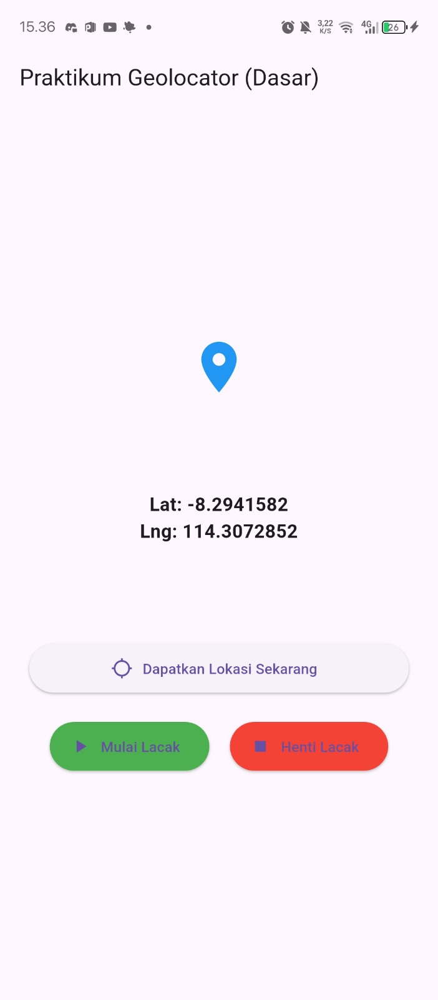

# Geolocator_Project

**Tugas 1**: Geocoding (Alamat dari Koordinat)
Saat ini kita hanya menampilkan Lat/Lng. Buatlah agar aplikasi menampilkan alamat
(nama jalan, kota, dll) dari koordinat yang didapat.
Petunjuk:
1. Anda sudah menambahkan paket geocoding di pubspec.yaml.
2. Import paketnya: import ’package:geocoding/geocoding.dart’;
3. Buat variabel String? currentAddress; di MyHomePageState.
4. Buat fungsi baru getAddressFromLatLng(Position position).
5.  Panggil fungsi getAddressFromLatLng( currentPosition!) di dalam getLocation
dan startTracking (di dalam .listen()) setelah setState untuk currentPosition.
6. Tampilkan currentAddress di UI Anda, di bawah Lat/Lng.

===================================================================================
## Beberapa Bagian

ini adalah fungsi untuk mengkoversi koordinat menjadi alamat dan fungsi ini menggunakan paket geocoding untuk mendapatkan detail alamat.

ini adalah fungsi untuk mendapatkan lokasi sekarang.

ini adalah fungsi untuk melacak lokasi, dan ini akan diupdate secara real time.

ini adalah fungsi untuk menampilkan lokasi yang sudah dikumpulkan.

## Berikut adalah hasilnya
Tampilan Sebelum 

Tampilan Setelah

# Tugas 2
## Hasil nya 

 

